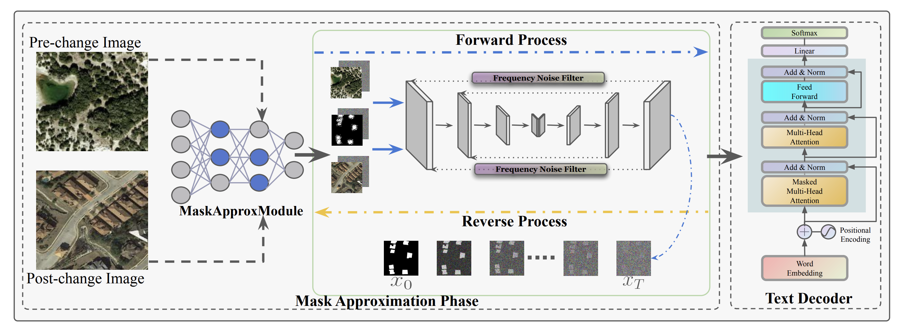
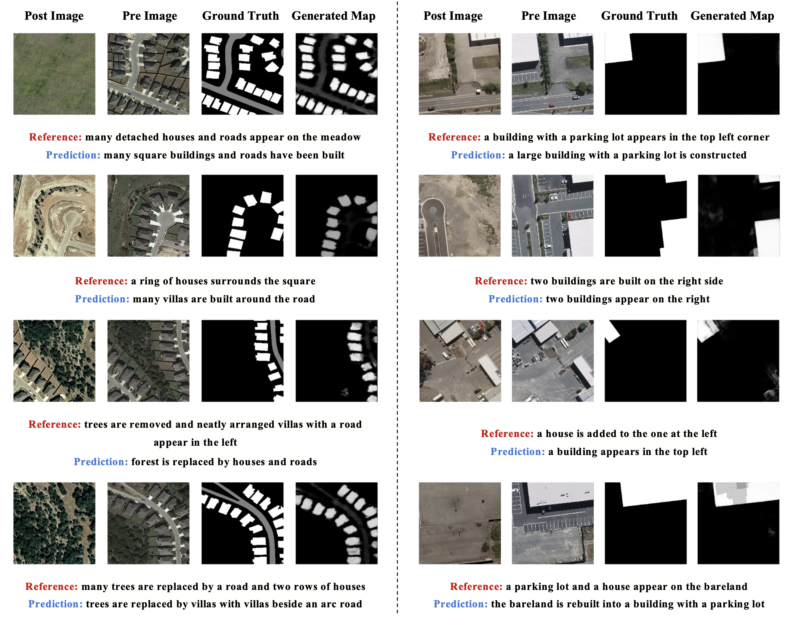

<h1 align="center">Mask Approximation Net: A Novel Diffusion Model Approach for Remote Sensing Change Captioning</h1>




This is the official PyTorch implementation of **[Mask Approximation Net: A Novel Diffusion Model Approach for Remote Sensing Change Captioning](https://ieeexplore.ieee.org/document/11075638)**.
<!-- a project conducted at the [Institute of Advanced Research in Artificial Intelligence (IARAI)](https://www.iarai.ac.at/). -->
### Authors  

[**Dongwei Sun**](https://scholar.google.com/citations?user=dqF0XkYAAAAJ&hl=zh-CN) | [**Jing Yao**](https://scholar.google.com/citations?user=1SHd5ygAAAAJ&hl=zh-CN) | [**Wu Xue**]() | [**Changsheng Zhou**](https://scholar.google.com/citations?user=Uz7s7hsAAAAJ&hl=zh-CN) | [**Pedram Ghamisi**](https://scholar.google.com/citations?user=Gr9afd0AAAAJ&hl=zh-CN) | [**Xiangyong Cao**](https://scholar.google.com/citations?user=IePM9RsAAAAJ&hl=zh-CN)

### Preparation
- Install the required packages: `pip install -r requirements.txt`
- Download the remote sensing change captioning datasets LEVIR and WHU-CDC.


### Training
- Ensure you have completed the data preparation steps above, and then proceed to train the model as follows:
```
$ python scripts/segmentation_train.py --image_size 256 --num_channels 128 --class_cond False --num_res_blocks 2 --num_heads 1 --learn_sigma True --use_scale_shift_norm False --attention_resolutions 16 --diffusion_steps 1000 --noise_schedule linear --rescale_learned_sigmas False --rescale_timesteps False --lr 1e-4 --batch_size 8
```

!NOTE: If the program encounters the error: "'Meteor' object has no attribute 'lock'," we recommend installing it with `sudo apt install openjdk-11-jdk` to resolve this issue.

### Testing
- After training step, to test the accuracy on test dataset as follows:
```
$ python scripts/segmentation_sample.py --image_size 256 --num_channels 128 --class_cond False --num_res_blocks 2 --num_heads 1 --learn_sigma True --use_scale_shift_norm False --attention_resolutions 16 --diffusion_steps 1000 --noise_schedule linear --rescale_learned_sigmas False --rescale_timesteps False --num_ensemble 5
```

### Visual Examples


Here are some visualized examples :




### Paper
**[Mask Approximation Net: A Novel Diffusion Model Approach for Remote Sensing Change Captioning](https://ieeexplore.ieee.org/document/11075638)**

Please cite the following paper if you find it useful for your research:

```
@ARTICLE{11075638,
  author={Sun, Dongwei and Yao, Jing and Xue, Wu and Zhou, Changsheng and Ghamisi, Pedram and Cao, Xiangyong},
  journal={IEEE Transactions on Geoscience and Remote Sensing},
  title={Mask Approximation Net: A Novel Diffusion Model Approach for Remote Sensing Change Captioning},
  year={2025},
  doi={10.1109/TGRS.2025.3587261}}
```

### Acknowledgement

- The authors would like to thank the contributors to the LEVIR and WHU-CDC datasets.
- The authors would like to thank the work [Chg2cap](https://arxiv.org/abs/2304.01091), [Medical Image Segmentation](https://github.com/SuperMedIntel/MedSegDiff).

### License
This repo is distributed under [MIT License](https://github.com/ShizhenChang/Chg2Cap/blob/main/LICENSE.txt). The code can be used for academic purposes only.
